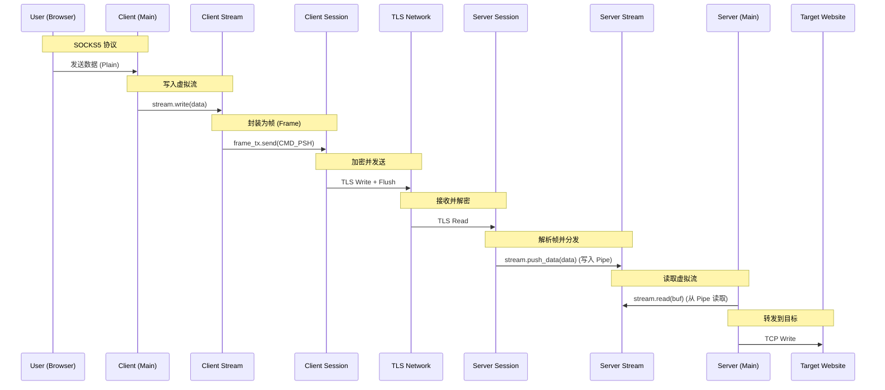
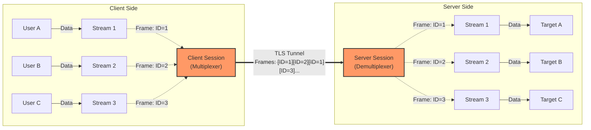

# AnyTLS 代码架构与协议实现详解

本文档详细解析 AnyTLS 的代码结构与核心协议实现细节。

## 1. 总体架构

AnyTLS 是一个基于 TLS 1.3 的隧道代理工具，旨在将 SOCKS5 流量封装在标准的 TLS 连接中。其核心设计理念是**多路复用 (Multiplexing)**，即在一条物理 TLS 连接（Session）上承载多个逻辑数据流（Stream）。

### 核心组件

- **Client (`bin/client`)**: 本地 SOCKS5 服务器，负责接收用户请求，通过 TLS 连接转发给 Server。
- **Server (`bin/server`)**: 远程 TLS 服务器，负责解包 TLS 流量并转发到目标网站。
- **Session (`proxy/session/inner.rs`)**: 管理一条物理 TLS 连接，负责帧（Frame）的读写、分发和心跳维护。
- **Stream (`proxy/session/stream.rs`)**: 代表一个逻辑连接（如一次网页请求），提供类似 `TcpStream` 的读写接口。
- **Pipe (`proxy/pipe`)**: 用于 Stream 与 Session 之间的高效异步数据缓冲通道。

---

## 2. 客户端流程 (`bin/client/main.rs`)

### 2.1 入口与初始化

- 程序启动后监听本地 SOCKS5 端口（默认 1080）。
- 初始化 `Client` 结构体 (`proxy/session/client.rs`)，配置连接池参数（空闲超时、最小空闲数等）。
- **TLS 配置**: 使用 `rustls`，并配置了一个“危险”的证书验证器 `AllowAnyCertVerifier`，允许连接自签名证书的服务器。

### 2.2 SOCKS5 握手

当浏览器发起连接时：

1.  `handle_connection` 处理标准的 SOCKS5 握手（无需认证）。
2.  解析目标地址（IPv4/IPv6/Domain）。
3.  **建立隧道**: 调用 `client.create_stream()` 获取一个虚拟流 (`Stream`)。
4.  **发送目标地址**: 将 SOCKS5 请求中的目标地址直接写入 `Stream`。
5.  **数据转发**: 启动两个异步任务 (`c2p`, `p2c`) 在本地 TCP 连接和虚拟 `Stream` 之间双向拷贝数据。

### 2.3 连接池管理 (`proxy/session/client.rs`)

这是客户端的核心优化逻辑：

- **复用策略**:
  1.  优先从 `idle_sessions` 池中获取空闲会话。
  2.  其次尝试复用活跃但负载较低（Stream 数 < 3）的会话。
  3.  最后才建立新的 TLS 连接。
- **空闲回收**: `spawn_idle_waiter` 监控会话状态，当会话所有流关闭后，将其放回空闲池以备下次秒开。

---

## 3. 服务端流程 (`bin/server/main.rs`)

### 3.1 监听与接收

- 监听 TCP 端口（默认 443）。
- 使用 `mkcert` 动态生成自签名证书。
- **TCP 优化**: 开启 `TCP_NODELAY` 和 `TCP_KEEPALIVE`，确保低延迟和死链检测。

### 3.2 握手与鉴权

1.  **TLS 握手**: 建立标准 TLS 1.3 连接。
2.  **应用层鉴权**:
    - 读取前 34 字节：32 字节密码哈希 (SHA256) + 2 字节 Padding 长度。
    - 验证密码，失败则断开。
    - 读取并丢弃指定长度的 Padding 数据（用于混淆流量特征）。
3.  **会话创建**: 创建 `Session::new_server`，并传入回调函数处理新流。

### 3.3 目标连接

当 Session 收到新流请求 (`CMD_SYN`)：

1.  触发回调，读取流中的第一个数据包（包含 SOCKS5 目标地址）。
2.  `TcpStream::connect` 连接目标网站。
3.  **数据转发**: 在目标 TCP 连接和虚拟 `Stream` 之间双向拷贝数据。

---

## 4. 核心协议实现 (`proxy/session`)

### 4.1 帧结构 (`frame.rs`)

所有数据在 TLS 隧道中都被封装为“帧”：

```
+------+------+--------+------+
| CMD  | SID  | LEN    | DATA |
+------+------+--------+------+
| 1B   | 4B   | 2B     | Var  |
+------+------+--------+------+
```

- **CMD (1B)**: 命令类型 (SYN, PSH, FIN, HEART_REQUEST 等)。
- **SID (4B)**: 流 ID，用于区分不同的请求。
- **LEN (2B)**: 数据载荷长度。
- **DATA**: 实际数据。

### 4.2 会话管理 (`inner.rs`)

`Session` 是协议的心脏，负责多路复用：

- **读循环 (`recv_loop`)**:
  - 从 TLS 连接读取字节流。
  - 解析帧头，提取 `CMD` 和 `SID`。
  - **分发**:
    - `CMD_PSH`: 找到对应的 `Stream`，将数据写入其 `Pipe`。
    - `CMD_SYN`: (服务端) 创建新 `Stream` 并触发回调。
    - `CMD_FIN`: 关闭对应 `Stream` 的写入端。
    - `CMD_HEART_*`: 处理心跳，保持连接活跃。
- **写操作**:
  - 使用独立的 control queue 和按 SID 分组的 data scheduler 接收各 `Stream` 发来的帧。
  - data queue 采用 round-robin 调度，control queue 使用有限 burst，避免任一类流量永久饥饿。
  - Session 级 outbound/inbound byte budget 限制排队内存，单个 Stream 关闭时释放其资源。
  - 通过 `tokio::io::split` 分离出的 `WriteHalf` 写入 TLS 连接。
  - **关键优化**: 每次写入后强制 `flush()`，配合 `TCP_NODELAY` 消除缓冲延迟。

### 4.3 流抽象 (`stream.rs`)

`Stream` 模拟了标准的 `AsyncRead` / `AsyncWrite` 接口：

- **写数据**: 将数据封装为 `CMD_PSH` 帧，通过 `frame_tx` 发送给 Session。
- **读数据**: 从内部的 `PipeReader` 读取由 Session 分发来的数据。
- **关闭**: 发送 `CMD_FIN` 帧。为防止死锁，发送操作在后台异步任务中执行。
  - 读写方向独立关闭；peer FIN 只关闭本地读半部，Stream 仅在两端都关闭后从 Session 移除。

### 4.4 管道机制 (`proxy/pipe/io_pipe.rs`)

为了解决异步读写中的死锁和数据竞争，实现了一个自定义的 `Pipe`：

- **结构**: 包含一个 `mpsc` 通道（用于数据传输）和一个字节缓冲区（用于暂存未读完的数据）。
- **死锁解决**:
  - `read` 操作在等待数据时**不持有锁**。
  - 利用 `mpsc` 的关闭特性（Sender Drop -> Receiver Return None）来优雅地处理 EOF，确保所有缓冲数据被读完后再返回结束信号。

---

## 5. 关键技术细节总结

1.  **并发模型**: 使用 Tokio 的异步任务 (`tokio::spawn`) 处理每个连接和流，实现高并发。
2.  **死锁预防**:
    - Session 的读写分离 (`split`)。
    - Stream 发送控制帧（如 FIN）时的异步化。
    - Pipe 读取时的锁释放机制。
3.  **性能优化**:
    - **连接复用**: 减少 TLS 握手开销。
    - **Zero Copy**: 在可能的情况下尽量减少内存拷贝（虽然 Frame 封装不可避免会有一次拷贝）。
    - **即时发送**: 强制 Flush 避免 Nagle 算法和 TLS 缓冲带来的延迟。
4.  **健壮性**:
    - **Keepalive**: 应用层主动 heartbeat + TCP 层 Keepalive 双重保障，90 秒无响应时回收 carrier。
    - **优雅关闭**: 确保 Session 和 Stream 的状态在网络异常时能正确同步，防止僵尸连接。

---

## 6. 核心数据流向总结

以下图表展示了从用户发起请求到目标网站接收数据的完整流向：



---

## 7. 多路复用 (Multiplexing) 原理 （版本 3 里 已经 删除）

AnyTLS 使用单条 TLS 连接承载多个逻辑流（Stream），极大地减少了握手延迟并提高了传输效率。



## 8. 关于 FIN 包

- 服务端 主动 发送 FIN 包
  - 这种情况会按“远端半关闭”处理，不会把它当成“整条逻辑流已经结束”。
  - 更具体地说，服务端发来的 FIN 只说明“服务端这一侧以后不再向客户端发送数据了”，
    不等于“客户端也必须立刻停止发送”，更不等于“这条 session 现在就可以回收到 idle pool”。
    否则就会把一个还没真正双向结束的流过早复用，重新撞上你前面刚抓到的那类错位问题。
  - 这样处理：
    - 收到服务端 FIN 后，把“远端发送方向”标记为关闭。
    - 客户端读侧在把已缓冲数据读完后，向本地应用返回 EOF。
    - 客户端写侧继续允许本地应用发送剩余数据，只要本地应用还没 EOF。
    - 这条 session 不能进入 idle pool。
    - 等客户端自己也发出 FIN，也就是本地发送方向关闭后，才认为这条逻辑流真正结束。
    - 只有本地和远端两个方向都关闭后，才允许复用这条 session。
    - 如果客户端在远端 FIN 之后继续写，但服务端到目标的写入失败，就把它升级成错误并终止这条 session。

- 客户端 发送 FIN 给 服务端 后
  - 必须 等到 服务端 发回的 FIN 包
  - 这里的 FIN 兼具“我这边不再发送请求数据了”和“这一条逻辑流可以安全回收到 idle pool”两层语义。
  - 如果客户端在自己发完 FIN 后就立刻把 session 视为可复用，会出现问题：
    上一条响应还没完全从服务端回完，下一条请求就抢先复用了同一条会话，
    结果把旧流尾部和新流的 TLS 握手串在一起，触发 tlsv1 alert decode error。
    这也是为什么现在客户端必须等服务端那边真正结束当前目标连接、回 FIN 之后，再把逻辑流关闭并放回 idle pool。
  - 协议层必须等到“服务端回 FIN 或其他明确的流结束信号”之后，才能把这条 session 当成可复用。
    否则只能选择另一种更保守的语义：客户端一发 FIN 就直接销毁整条 session，不做复用。
    现在既想保留复用，就必须等服务端确认这条逻辑流真的结束了。
